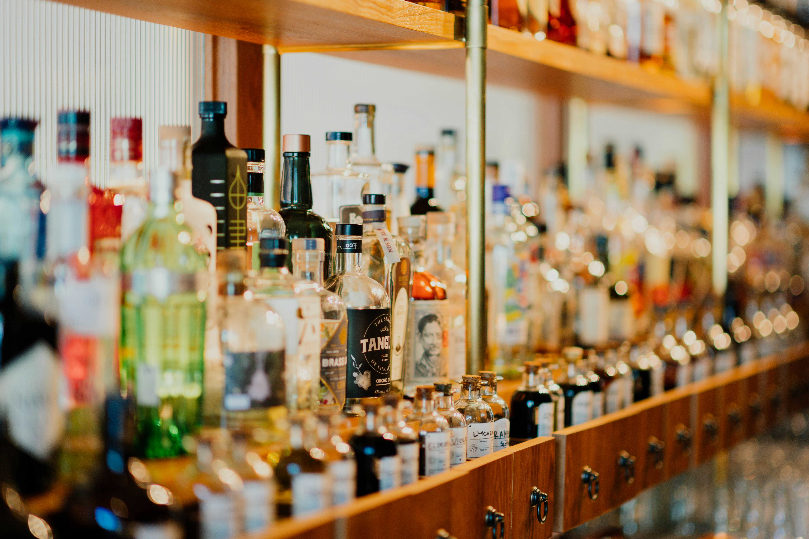

# Iowa Liquor Sales Analysis (2018-2022)
Geospatial and time-series analysis of sales data, searching for seasonal trends, economic recovery post-pandemic, and top/bottom performing products. 

# Project Overview
I chose this dataset because I have prior experience in retail management and an interest in the sales/marketing sphere of data analytics. This data let me investigate sales prior to, during, and after the pandemic, identifying sales patterns, forecasting future trends, and evaluating product performance. To do this, I utilized a number of different techniques and skills within Python, Excel, and Tableau.  

## Key Questions & Objectives
### Sales Volume   
Which stores have the highest/lowest sales?    
Which counties have the highest/lowest sales?    
Which product have the highest/lowest sales?    
### Pandemic Recovery   
Have sales recovered to pre-pandemic levels? If not, when is that estimated to happen?    
### Seasonality & Trends   
When are the largest purchases made?    
Are there seasonal trends to liquor purchases in the state?    
### Sales & Population   
Are there any locations that have purchases beyond what their population would suggest? 

## Stakeholders
<ul><b>Marketing Team:</b> What products are sliding in popularity? What inventory has been sitting on the shelves? What are the best times and locations to run promotions?</ul> 
<ul><b>Inventory Management:</b>  What products are not worth the cost of keeping on hand?</ul>
<ul><b>Sales Operations:</b> What products are meeting sales metrics? Which are not?</ul>

# Installation & Setup
## Codes & Resources Used
<ul><b>Editor Used:</b> Jupyter Notebook</ul>
<ul><b>Python Version:</b> 2.7 </ul>

## Python Packages Used
<ul><b>General Purpose:</b> os</ul>
<ul><b>Data Manipulation:</b> pandas, numpy</ul>
<ul><b>Data Visualization:</b> matplotlib, seaborn, folium, json</ul>
<ul><b>Machine Learning:</b> scipy</ul>

# Data
## Source Data
[Liquor Sales Data](https://data.iowa.gov/Sales-Distribution/Iowa-Liquor-Sales/m3tr-qhgy), accessed from the Iowa Open Data Platform on 11/18/2023   
[Iowa County Population Data](https://www.census.gov/data/datasets/time-series/demo/popest/2020s-counties-total.html), accessed from the US Census Bureau on 11/24/2023   
[Geospatial Data](https://geodata.iowa.gov/datasets/8a1c2d500d8847d79aa47d45d44eb133_0/explore), accessed from Iowa Geospatial Data on 11/25/2023

## Procedures Conducted Outside Python   
Verified no duplicate extracted addresses (Excel)   
Added state column prepping for latitude/longitude importing (Excel)   
Cleaned unnecessary information from address column, notated row and what was (temporarily) removed (Excel)   
Uploaded spreadsheet to Geocodio to get latitude/longitude data (Geocodio)   
Saved original Geocodio csv with all data (including accuracy and source)   
Removed unnecessary columns that don't need to be appended into dataset (Excel)   
Saved revised csv as iowa_data_lats_longs 

# Code Structure
Filtering Dataset to the Scope of the Project   
Cleaning & Wrangling Filtered Data   
Descriptive Statistics   
Adding Population Data & Exploring Relationships   
Updating Location Information   
Geospatial Exploratory Analysis    
Regression Analysis    
Clustering & Analysis   
Time Series Analysis (Daily)   
Time Series Analysis (Monthly)   
Time Series Forecasting   

# Process & Results
### Prep
After filtering the data to the years I needed (2018-2022), I investigated the dataset and discovered a number of null values for store location (latitude, longitude), county number (the FIPS number), categories, and addresses. I extracted the addresses into one CSV and the categories into another CSV, and found the missing data within the main dataset (rows with missing addresses had the store name, and rows with the missing category had the item number and description, allowing me to reverse-engineer the missing data from the dataset). 

Once that was done, I pulled the latitude and longitude for each store from Geocodio, and obtained the county FIPS information (and population) from the US Census Bureau Iowa data. With that added, my dataset was complete for all further analysis. 

### Analysis
First I conducted a <b>descriptive statistics investigation</b> to see where my outliers are, as well as to look at any possible data entry errors. Once that was complete, I conducted <b>exploratory visualization</b> analysis, including a correlation heatmap of my quantitative data, as well as creating pair plots. I also separated my bottle size into categories to see which bottle size sells the most frequently. 

Following that, I examined some of the data through a number of choropleths, examining how the data is distributed across Iowa counties. 

Next, I set up a <b>multiple regression analysis</b> to look at sale dollars by bottles sold (understandably, the more bottles sold, the greater the sale dollars), sale dollars by state bottle cost (while a more expensive bottle does affect the bottom line, you sell more of the affordably priced offerings and therefore their influence on the final total is greater). 

After that, I ran some <b>k-means clustering</b> to get another look at data and other ways it may be grouped, taking a look specifically at sale dollars, bottle cost, bottle volume, and bottles sold. 

Finally, I conducted some <b>time-series analysis and forecasting</b> to find any sales trends & overall information not yet found in prior analysis. This revealed seasonal trends (there are always spikes in October and December, and there's always a big dip in January), as well as revealing that not only was there no pandemic dip (sales in 2020 were actually better than in 2018 and 2019), sales have continued to rise. 

### Recommendations & Next Steps
The forecasting is showing sales continuing to rise; when 2023 is over, it's essential to check the modeling with the actual data to see if the model is correct or needs to be adjusted. 

A more in-depth analysis of the lowest performing products (for example, if they are a large part of a county's sales, even if that county's sales are small in the overall picture) should be performed to see if they should be kept on hand or removed from the options available. 

### Final Presentation
[Full Tableau Presentation](https://public.tableau.com/app/profile/therightwright/viz/IowaLiquorSalesAnalysis_17022462743500/IowaLiquorSalesAnalysis2018-2022)   
     

# Acknowledgments/References
Header photo by [CHUTTERSNAP](https://unsplash.com/@chuttersnap?utm_content=creditCopyText&utm_medium=referral&utm_source=unsplash) on [Unsplash](https://unsplash.com/photos/close-up-photo-of-liquor-bottles-in-rack-9UD0JHnWyVE?utm_content=creditCopyText&utm_medium=referral&utm_source=unsplash)
