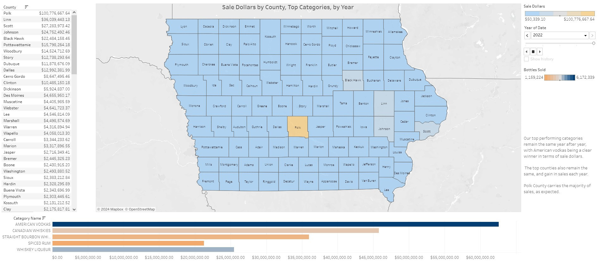
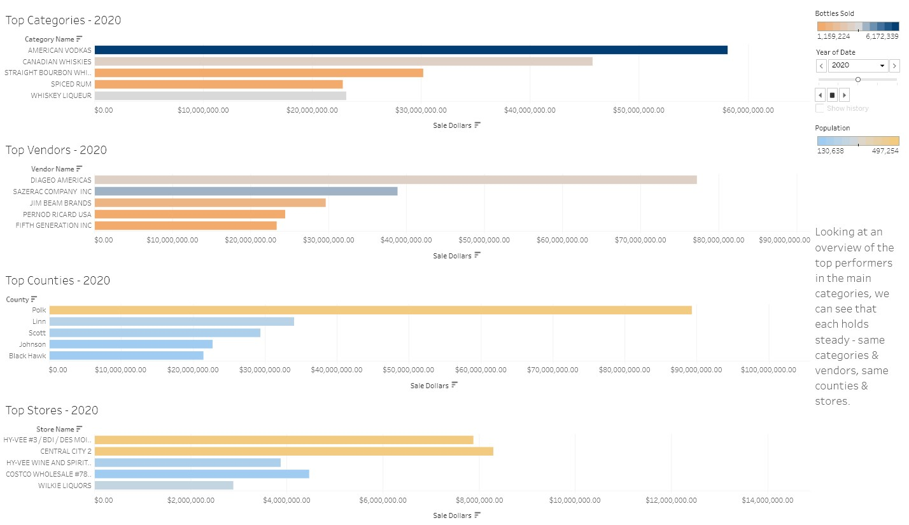

# Liquor Sales Analysis (2018-2022)
The state is the wholesaler for class E liquor retailers. All alcoholic beverages stocked by class E liquor retailers must be purchased through the state Alcoholic Beverages Department (ABD) portal.

## Stakeholders
<ul><b>Marketing Team:</b> What products are sliding in popularity? What inventory has been sitting on the shelves? What are the best times and locations to run promotions?</ul> 
<ul><b>Inventory Management:</b> When are the largest purchases made? What products are not worth the cost of keeping on hand?</ul>
<ul><b>Sales Operations:</b> Where are our highest and lowest sales? Have sales recovered to pre-pandemic levels? If not, when is that estimated to happen?</ul>

## Overview
Between 2018 and 2022, 12.5 million orders were placed with the state Alcoholic Beverages Department, for a total of $1.9 trillion in sales. 

I analyzed overall sales, vendor performance, sales by location, and product performance to provide insights and recommendations to cross-functional departments (marketing, sales, inventory management).

## Summary of Insights
### Overall Sales Analysis
**Year over Year:** Sales have grown year over year, with the biggest jump (13.59%) during the pandemic. Sales growth leveled out from 2021 to 2022 (which saw a growth of only 0.15%), but they held level at approximately $430m a year, rather than dropping.    

**Seasonality:** There are always spikes in October and December, followed by a large drop in January.   

     

**Vendor Analysis:** by vendor

**Geospatial Analysis:** (bestsellers per county) - can this bring in choropleths?? county distribution

**Multiple Regression Analysis:** of sale dollars by bottles sold (understandably, the more bottles sold, the greater the sale dollars) and sale dollars by state bottle cost (while a more expensive bottle does affect the bottom line, you sell more of the affordably priced offerings and therefore their influence on the final total is greater)

### K-Means Clustering
so what exactly are we saying here lmao

### Sales Forecasting
The sales forecast shows a continuing upward trend, and examining our annual sales peaks, predicts October sales of $44 million, and December sales of $45.4 million.   

## Recommendations & Next Steps
The forecasting is showing sales continuing to rise; when 2023 is over, it's essential to check the modeling with the actual data to see if the model is correct or needs to be adjusted. 

A more in-depth analysis of the lowest performing products (for example, if they are a large part of a county's sales, even if that county's sales are small in the overall picture) should be performed to see if they should be kept on hand or removed from the options available. 

## Final Presentation
[Full Tableau Presentation](https://public.tableau.com/app/profile/therightwright/viz/IowaLiquorSalesAnalysis_17022462743500/IowaLiquorSalesAnalysis2018-2022)   
     

## APPENDIX - Technical Information (Setup & Data)
### Prep
After filtering the data to the years I needed (2018-2022), I investigated the dataset and discovered a number of null values for store location (latitude, longitude), county number (the FIPS number), categories, and addresses. I extracted the addresses into one CSV and the categories into another CSV, and found the missing data within the main dataset (rows with missing addresses had the store name, and rows with the missing category had the item number and description, allowing me to reverse-engineer the missing data from the dataset). Once that was done, I pulled the latitude and longitude for each store from Geocodio, and obtained the county FIPS information (and population) from the US Census Bureau Iowa data. With that added, my dataset was complete for all further analysis. 

### Codes & Resources Used
<ul><b>Editor Used:</b> Jupyter Notebook</ul>
<ul><b>Python Version:</b> 2.7 </ul>

### Python Packages Used
<ul><b>General Purpose:</b> os</ul>
<ul><b>Data Manipulation:</b> pandas, numpy</ul>
<ul><b>Data Visualization:</b> matplotlib, seaborn, folium, json</ul>
<ul><b>Machine Learning:</b> scipy</ul>

### Source Data
[Liquor Sales Data](https://data.iowa.gov/Sales-Distribution/Iowa-Liquor-Sales/m3tr-qhgy), accessed from the Iowa Open Data Platform on 11/18/2023   
[Iowa County Population Data](https://www.census.gov/data/datasets/time-series/demo/popest/2020s-counties-total.html), accessed from the US Census Bureau on 11/24/2023   
[Geospatial Data](https://geodata.iowa.gov/datasets/8a1c2d500d8847d79aa47d45d44eb133_0/explore), accessed from Iowa Geospatial Data on 11/25/2023

### Procedures Conducted Outside Python   
Verified no duplicate extracted addresses (Excel)   
Added state column prepping for latitude/longitude importing (Excel)   
Cleaned unnecessary information from address column, notated row and what was (temporarily) removed (Excel)   
Uploaded spreadsheet to Geocodio to get latitude/longitude data (Geocodio)   
Saved original Geocodio csv with all data (including accuracy and source)   
Removed unnecessary columns that don't need to be appended into dataset (Excel)   
Saved revised csv as iowa_data_lats_longs 

### Code Structure
Filtering Dataset to the Scope of the Project   
Cleaning & Wrangling Filtered Data   
Descriptive Statistics   
Adding Population Data & Exploring Relationships   
Updating Location Information   
Geospatial Exploratory Analysis    
Regression Analysis    
Clustering & Analysis   
Time Series Analysis (Daily)   
Time Series Analysis (Monthly)   
Time Series Forecasting (Simple, Holt's Linear, Holt-Winter Exponential)

# Acknowledgments/References
Header photo by [CHUTTERSNAP](https://unsplash.com/@chuttersnap?utm_content=creditCopyText&utm_medium=referral&utm_source=unsplash) on [Unsplash](https://unsplash.com/photos/close-up-photo-of-liquor-bottles-in-rack-9UD0JHnWyVE?utm_content=creditCopyText&utm_medium=referral&utm_source=unsplash)
